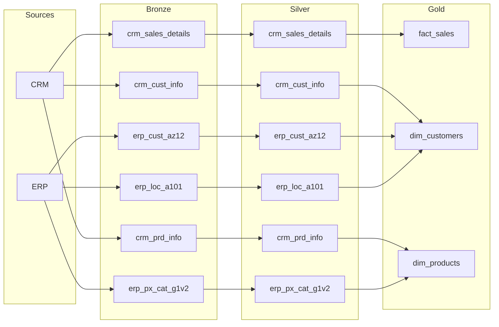

# Plano de Modernização — Data Warehouse Project

> Documento de referência para executar com o Claude Code, fase a fase.
> Cada fase é pensada para ser uma sessão/branch isolada, com critérios claros de "feito".

---

## 0. Contexto (estado atual, resumido)

Repositório atual: Postgres + arquitetura medallion (bronze/silver/gold) com scripts SQL manuais.

**O que já existe e funciona:**
- `scripts/init_database.sql` — cria a BD `data_warehouse_project` e os 3 schemas.
- `scripts/bronze/bronze_layer_ddl_script.sql` + `load_bronze_layer.sql` — ingestão via `COPY`, com retry (3x), log persistente (`bronze.load_errors`), timing por tabela. **Caminhos dos CSV estão hardcoded** para uma máquina local.
- `scripts/silver/ddl_silver.sql` + `silver_load_procedure.sql` — limpeza e normalização reais (dedupe, parsing de chaves, normalização de categóricos, recálculo de vendas, datas). Tratamento de erro mais fraco que a Bronze; `CALL` comentado.
- `docs/` — dois diagramas de arquitetura (drawio + PNG).
- `AGENTS.md` — já documenta inconsistências conhecidas (nomes de ficheiros, nome da BD).

**O que não existe:**
- Camada **Gold** (nenhum DDL, nenhuma view, nenhum star schema) — apesar de estar descrita no README e nos diagramas.
- Testes automatizados (`tests/` só tem um placeholder).
- Orquestração, containerização, CI/CD, histórico (SCD), observabilidade centralizada.

**Objetivo deste plano:** portfólio forte + aprendizagem do stack moderno + qualidade suficiente para uso real, usando dbt + Airflow + Docker + CI/CD como espinha dorsal.

---

## 1. Arquitetura alvo

```
Fontes (CRM/ERP CSV)
        │
        ▼
┌─────────────────────────────────────────────┐
│  Docker Compose · Postgres                   │
│                                               │
│   Bronze  →  Staging (dbt)  →  Marts (dbt)   │
│   (raw)      (ex-Silver:      (ex-Gold:       │
│               limpeza+testes)  star schema+   │
│                                 snapshots SCD2)│
└─────────────────────────────────────────────┘
        │
        ▼
   Consumo (BI, SQL ad hoc, ML)

Orquestrado de ponta a ponta por Airflow.
Validado em cada run e em cada PR por dbt tests + GitHub Actions.
Observado por logs, alertas e dashboards de qualidade de dados.
```

**Decisões de stack (padrão assumido — ver secção 9 para alternativas):**
| Camada | Escolha | Porquê |
|---|---|---|
| Base de dados | PostgreSQL (mantém) | Já funciona, grátis, bem suportado por dbt |
| Transformação | **dbt-core** | Substitui os procedures manuais por modelos testáveis, documentados e com lineage automático |
| Orquestração | **Airflow** | É o que mais aparece em vagas de Data Engineer; integra-se bem com dbt (`Cosmos` ou `BashOperator`) |
| Containers | **Docker Compose** | Reprodutibilidade — acaba com o problema dos caminhos hardcoded |
| CI/CD | **GitHub Actions** | Já estás no GitHub; corre `dbt build` + lint em cada PR |
| Qualidade de dados | **dbt tests** (+ `dbt-utils`) | Nativo do dbt, sem ferramenta extra a gerir |
| Histórico | **dbt snapshots (SCD2)** | Feature dedicada do dbt para exatamente este problema |
| Observabilidade | dbt artifacts + dashboard (Metabase) | Leve, sem infraestrutura extra pesada |
| Lineage ao vivo | **OpenLineage + Marquez** | Standard aberto da indústria; Airflow e dbt já têm integração oficial, sem reescrever DAGs/models; dá o grafo bronze→staging→marts a atualizar em tempo real |

---

## 2. Roadmap por fases

### Fase 0 — Higiene e fundação
**Objetivo:** parar a sangria antes de construir por cima.

- [ ] Resolver os caminhos hardcoded do `load_bronze_layer.sql` — usar variável de ambiente ou `\set` do psql, apontando para `datasets/` do próprio repo (caminho relativo/local).
- [ ] Alinhar nomes: escolher uma convenção única de ficheiros (`ddl_bronze.sql`, `load_bronze.sql`, `ddl_silver.sql`, `load_silver.sql`) e atualizar README para bater certo com o que existe.
- [ ] Corrigir a divergência do nome da base de dados (README diz `data_warehouse`, script cria `data_warehouse_project`) — fixar `data_warehouse_project` em todo o lado.
- [ ] Adicionar `.gitignore` (`.DS_Store`, `.env`, `target/`, `dbt_packages/`, `logs/`) e remover `.DS_Store` já versionados.
- [ ] Descomentar/mover o `CALL silver.load_silver()` para um script de execução separado da definição do procedure (separar "definir" de "correr").
- [ ] Validação leve de schema antes do `COPY`: script `scripts/bronze/validate_headers.sh` que compara a primeira linha (header) de cada CSV em `datasets/` contra uma lista de colunas esperadas (`scripts/bronze/expected_headers.txt`, um manifesto por fonte). Falha cedo com mensagem clara se uma fonte mudar de colunas, em vez de o `COPY` falhar a meio do batch ou carregar dados desalinhados silenciosamente. Corre antes do `CALL bronze.load_bronze()` — e mais tarde antes da task de extração no DAG da Fase 5. (Não substitui os testes dbt da Fase 4 — esses validam o *conteúdo*; isto valida a *forma* do ficheiro antes de ele sequer chegar à Bronze.)

**Definition of Done:** `psql` corre bronze + silver de ponta a ponta em qualquer máquina, só configurando uma variável de ambiente — e falha imediatamente, com mensagem clara, se uma fonte mudar de schema antes mesmo de tentar o `COPY`.

---

### Fase 1 — Completar a Gold layer (em SQL puro, antes da migração para dbt)
**Objetivo:** o maior buraco funcional do projeto deixa de existir.

- [ ] `gold.dim_customers` — merge de `crm_cust_info` + `erp_cust_az12` + `erp_loc_a101`, com chave surrogate (`customer_key`), critério de prioridade definido para campos conflituosos (ex.: género vem do CRM, cai para ERP se nulo).
- [ ] `gold.dim_products` — merge de `crm_prd_info` + `erp_px_cat_g1v2`, chave surrogate, produtos correntes (ou preparado para histórico na Fase 6).
- [ ] `gold.fact_sales` — junta `crm_sales_details` às duas dimensões via as chaves surrogate, mantém as métricas (`sls_sales`, `sls_quantity`, `sls_price`).
- [ ] Decidir: views (sempre frescas, simples) vs tabelas materializadas (mais rápidas, precisam de refresh). Recomendação: começar com views; passar a tabelas/materialized views só se a performance pedir.
- [ ] Decidir e documentar já a chave de particionamento de `gold.fact_sales`, mesmo mantendo-a como view nesta fase — recomendação: `RANGE` por mês/ano sobre a data de venda (`sls_order_dt`, já vem tratada da Silver). Fixar a chave agora evita ter de redesenhar o grain quando a tabela passar a materializada (Fase 3) ou incremental (Fase 6) — nessa altura só muda a estratégia de armazenamento, não a chave.
- [ ] Quando `fact_sales` passar a tabela (materialized view ou modelo dbt materializado), aplicar particionamento nativo do Postgres (`PARTITION BY RANGE`) nessa coluna e indexar as chaves surrogate (`customer_key`, `product_key`) por partição — evita full scan nos joins com as dimensões à medida que o volume cresce.
- [ ] Atualizar `docs/data_catalog.md` com definições reais de coluna (o README já promete isto), com a chave de particionamento decidida, e com o diagrama de lineage em Mermaid (ver Anexo A no fim deste documento) — texto, não PNG, para o agente conseguir ler o design sem precisar de visão. Os dois diagramas atuais (`data_warehouse_project.drawio` e `bronze_silver_gold_data_flow_styled.png`) mantêm-se como estão nesta fase — só revisitar quando a Fase 3/5 mudarem a arquitetura que eles descrevem.

**Definition of Done:** `SELECT * FROM gold.fact_sales` devolve dados corretos e reconciliáveis com a Silver.

---

### Fase 2 — Containerização (Docker Compose)
**Objetivo:** "funciona na minha máquina" deixa de ser um problema.

- [ ] `infra/docker-compose.yml` — serviço `postgres` (com volume para persistência) + volume read-only para `datasets/` montado num caminho fixo (`/data/...`).
- [ ] `infra/.env.example` — credenciais/porta da BD, documentado no README.
- [ ] Scripts de ingestão passam a referenciar o caminho do container, não o caminho do host — resolve definitivamente o problema da Fase 0.
- [ ] `Makefile` ou scripts curtos (`make up`, `make init-db`, `make load-bronze`) para bootstrap num só comando.

**Definition of Done:** um colega clona o repo, corre `make up && make init-db && make load-bronze` e tem a Bronze populada sem tocar em caminhos.

---

### Fase 3 — Migração para dbt
**Objetivo:** a lógica de transformação ganha testes, documentação e lineage de borla.

- [ ] `dbt_project/` inicializado, ligado ao Postgres do Docker Compose.
- [ ] `models/staging/` — a lógica da Silver atual migrada para modelos dbt (`stg_crm__cust_info`, `stg_crm__prd_info`, `stg_crm__sales_details`, `stg_erp__cust_az12`, `stg_erp__loc_a101`, `stg_erp__px_cat`), seguindo a convenção de nomenclatura dbt.
- [ ] `models/staging/_sources.yml` — declara `bronze.*` como sources, com testes de freshness se fizer sentido.
- [ ] `models/marts/` — a lógica da Gold da Fase 1 migrada para `dim_customers`, `dim_products`, `fct_sales`.
- [ ] Testes dbt: `not_null` e `unique` nas chaves, `relationships` entre `fct_sales` e as dimensões, `accepted_values` para género/estado civil/linha de produto.
- [ ] `dbt docs generate` — catálogo de dados e grafo de lineage automáticos (substitui a manutenção manual do `data_catalog.md`).
- [ ] Manter os scripts SQL antigos em `legacy_sql/` como referência durante a transição (remover só quando o dbt estiver validado a produzir os mesmos resultados).

**Definition of Done:** `dbt build` corre staging + marts + todos os testes sem falhas, e `dbt docs serve` mostra o lineage completo Fontes → Bronze → Staging → Marts.

---

### Fase 4 — Qualidade de dados avançada
**Objetivo:** ir além dos testes genéricos do dbt.

- [ ] Adicionar `dbt-utils` para testes compostos (ex.: unicidade de combinação de colunas).
- [ ] Testes singulares (SQL custom) para regras de negócio específicas (ex.: `sls_sales = sls_quantity * sls_price` sempre que ambos existem).
- [ ] Estratégia de quarentena: linhas que falham validação vão para uma tabela `*_rejected` em vez de serem silenciosamente descartadas ou nulificadas.
- [ ] (Opcional, se o projeto crescer para "produção" a sério) avaliar Great Expectations/Soda para expectation suites mais ricas.

**Definition of Done:** uma linha inválida no CSV de origem não passa despercebida — aparece nos resultados de teste e/ou numa tabela de quarentena.

---

### Fase 5 — Orquestração (Airflow)
**Objetivo:** o pipeline deixa de precisar de alguém a correr `psql` à mão.

- [ ] Airflow via Docker Compose (webserver + scheduler + BD de metadados própria, separada da warehouse).
- [ ] DAG único: `extract_load_bronze` → `dbt run` (staging) → `dbt test` (staging) → `dbt run` (marts) → `dbt test` (marts) → notificação.
- [ ] Alerta (Slack ou e-mail) `on_failure_callback` em qualquer task que falhe.
- [ ] Agendamento diário (ou trigger por chegada de ficheiro, se quiseres simular uma fonte real).

**Definition of Done:** o pipeline inteiro corre sozinho a partir do Airflow UI, com retries automáticos e alerta se falhar.

---

### Fase 6 — Histórico e cargas incrementais
**Objetivo:** parar de perder histórico em cada full reload.

- [ ] `dbt snapshots` para `dim_customers` e `dim_products` — SCD Type 2 nativo do dbt, é literalmente o caso de uso para o qual a feature existe.
- [ ] `fct_sales` como modelo incremental (chave: `sls_ord_num` + `sls_prd_key`, ou data de order) em vez de full-refresh sempre.
- [ ] Bronze passa a acumular histórico de carga (append com `dwh_load_date`) em vez de truncate+insert puro, se quiseres auditar o que mudou entre execuções.

**Definition of Done:** alterar o género de um cliente no CSV de origem gera uma nova linha na dimensão com histórico, não substitui o valor antigo.

---

### Fase 7 — CI/CD
**Objetivo:** nenhuma alteração parte a warehouse sem ninguém reparar.

- [ ] `.github/workflows/ci.yml` — em cada PR: sobe um Postgres efémero (`services:` do GitHub Actions), corre `dbt build` completo contra ele, falha o PR se algum teste falhar.
- [ ] `sqlfluff` a lintar o SQL (dbt tem um dialeto suportado).
- [ ] Pre-commit hooks (trailing whitespace, bloquear `.DS_Store`, `sqlfluff fix`).
- [ ] (Opcional) publicar `dbt docs` automaticamente no GitHub Pages a cada merge em `main`.

**Definition of Done:** um PR com um teste dbt a falhar não pode ser mergeado sem alguém ver o erro no próprio PR.

---

### Fase 8 — Observabilidade, lineage ao vivo e governança
**Objetivo:** saber que o pipeline está saudável — e ver o fluxo de dados a acontecer — sem ter de ir espreitar logs manualmente.

- [ ] Subir o Marquez via Docker Compose (repo `MarquezProject/marquez`, script `./docker/up.sh`) como serviço adicional em `infra/docker-compose.yml`. Atenção: o Postgres interno do Marquez usa a porta 5432 por default — remapear (ex.: 5433) para não colidir com o Postgres da warehouse. UI em `localhost:3000`, API em `localhost:5000` (expõe também um endpoint GraphQL em `/api/v1-beta/graphql`, atualmente beta).
- [ ] Instalar `apache-airflow-providers-openlineage` no ambiente do Airflow — não exige alterar as DAGs, só configurar `OPENLINEAGE_URL` (a apontar para o Marquez) por variável de ambiente ou `airflow.cfg`.
- [ ] Instalar `openlineage-dbt` no ambiente do dbt e trocar `dbt run`/`dbt build` por `dbt-ol run`/`dbt-ol build` nas tasks do DAG (BashOperator/Cosmos) — usar a flag `--consume-structured-logs` (requer `openlineage-dbt` ≥ 1.26.0) para emitir eventos por modelo à medida que correm, em vez de só no fim do run inteiro.
- [ ] Confirmar no UI do Marquez que o grafo bronze→staging→marts aparece e atualiza a cada run — isto dá o lineage "ao vivo" a complementar o `dbt docs generate` estático da Fase 3 (que mostra a estrutura, não execuções reais).
- [ ] Schema `meta` (ou o package `dbt artifacts`/`elementary`) a guardar histórico de runs, taxa de sucesso de testes, duração ao longo do tempo.
- [ ] Dashboard simples (Metabase) sobre a saúde do pipeline: linhas carregadas, testes a passar, tendência de duração.
- [ ] Role de leitura dedicada e só-leitura para ferramentas de BI, separada da role usada pelo pipeline.

**Definition of Done:** consegues responder "o pipeline correu bem ontem?" olhando para um dashboard — e ver, ao vivo no Marquez, cada tabela a atualizar à medida que bronze→staging→marts corre.

---

### Fase 9 — Consumo / BI
**Objetivo:** fechar o ciclo até à camada "Consume" que já está nos diagramas.

- [ ] Ligar Metabase (ou Power BI) ao schema `gold`/marts.
- [ ] `docs/semantic_layer.md` — documentar métricas e dimensões do modelo de forma que qualquer analista entenda sem ler SQL.
- [ ] (Avançado, opcional) explorar o dbt Semantic Layer / MetricFlow para métricas governadas centralmente.

---

## 3. Estrutura de pastas alvo

```
data-warehouse-project/
├── datasets/                  # CSVs de exemplo (mantidos para dev/CI)
├── infra/
│   ├── docker-compose.yml
│   └── .env.example
├── legacy_sql/                # scripts SQL originais, mantidos até a Fase 3 validar o dbt
│   ├── bronze/
│   └── silver/
├── dbt_project/
│   ├── dbt_project.yml
│   ├── models/
│   │   ├── staging/
│   │   └── marts/
│   ├── snapshots/
│   ├── tests/
│   └── macros/
├── orchestration/
│   └── dags/
├── scripts/
│   └── bronze/                # ingestão raw fica fora do dbt
├── .github/workflows/ci.yml
├── docs/
├── AGENTS.md
└── README.md
```

## 4. Como usar isto com o Claude Code

- Uma fase = uma branch = uma sessão. Não misturar fases (ex.: não começar dbt antes de a Fase 1 estar fechada).
- No início de cada sessão, dar ao Claude Code o contexto: "lê `PLANO_MODERNIZACAO.md`, secção Fase N, e implementa apenas o que lá está."
- No fim de cada fase: atualizar o `AGENTS.md` e o README com o novo estado — evita a mesma divergência doc-vs-código que já existe hoje.
- Ordem recomendada: 0 → 1 → 2 → 3 → 4 → 5 → 6 → 7 → 8 → 9. As fases 0-2 podem ser feitas em paralelo/rápido; a partir da 3 cada uma depende da anterior.

## 5. Decisões em aberto (confirmar antes de arrancar)

- **Orquestração: Airflow (decidido).** Escolhido por ser o que mais aparece em vagas de Data Engineer, apesar de o Dagster ter integração nativa com dbt mais moderna (asset-based). Não é preciso reabrir esta decisão na Fase 5.
- **Lineage ao vivo: OpenLineage + Marquez (decidido).** Em vez de trocar de orquestrador só para ter um grafo em tempo real (o Dagster teria isto nativamente, via a sua própria API GraphQL), soma-se OpenLineage por cima do Airflow+dbt já escolhidos — standard aberto, sem código extra nas DAGs/models, e resolve o mesmo objetivo. Detalhe da Fase 8.
- **Views vs tabelas na Gold/Marts:** views são mais simples mas recalculam sempre; tabelas/incremental são mais rápidas mas precisam de refresh. Plano assume views até haver razão para mudar.
- **Manter os scripts SQL antigos?** Recomendo manter em `legacy_sql/` como referência histórica/prova de evolução (bom para portfólio mostrar o "antes e depois").

## Anexo A — Diagrama de lineage (Mermaid, para colar em `docs/data_catalog.md`)

Reflete o design já fechado na Fase 1 (`bronze_silver_gold_data_flow_styled.png`), em texto em vez de PNG:



Atualizar este bloco (não o PNG) sempre que o grain da Gold mudar — ex.: quando o particionamento de `fact_sales` ou o SCD2 das dimensões (Fase 6) entrarem.

