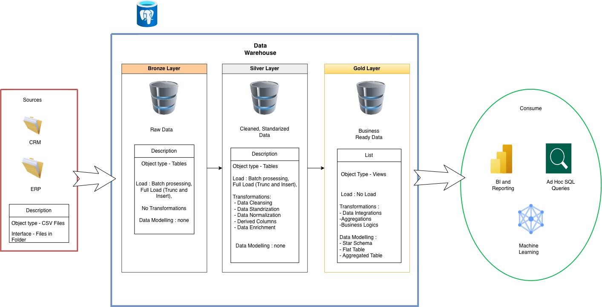
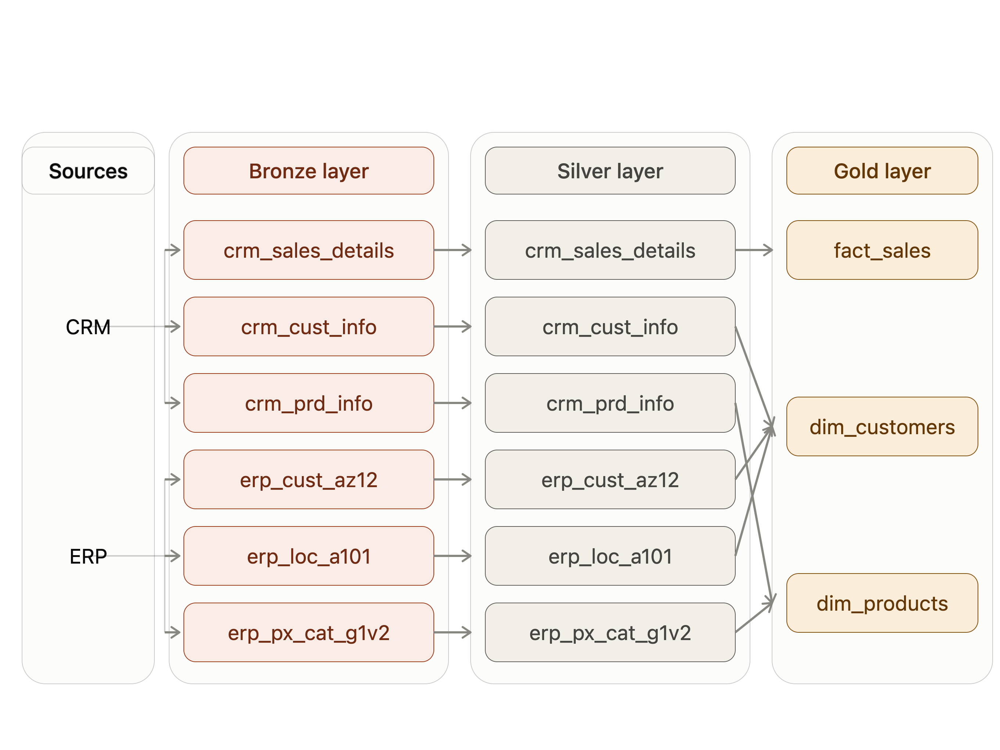

# Data Warehouse Project

A modern data warehouse built on **PostgreSQL**, following the **Medallion Architecture** (Bronze, Silver, Gold) to ingest, clean, and model data from CRM and ERP source systems for analytics, reporting, and machine learning.






## 🔗 Useful Links

- 📝 [Project Notion](https://app.notion.com/p/Data-Warehouse-Project-3c745b08c0b680ffa7fed0b348f511d0?source=copy_link) — planning, notes, and project steps
- 📐 [`docs/data_warehouse_project.drawio`](https://github.com/Afonsosequeira04/Data-Warehouse-Project/blob/main/docs/data_warehouse_project.drawio) — architecture diagram source (open in [draw.io](https://app.diagrams.net/))

---

## 📖 Overview

This project implements an end-to-end ETL pipeline that moves raw operational data through three progressively refined layers inside a single PostgreSQL data warehouse. It's designed to be simple to run locally, easy to extend, and a solid reference implementation of the medallion pattern in a PostgreSQL environment.

**Goals:**
- Consolidate data from multiple source systems (CRM, ERP) into one warehouse
- Apply consistent cleansing, standardization, and enrichment rules
- Deliver business-ready, query-friendly data for BI tools, ad hoc SQL, and ML workflows

---

## 🏗️ Architecture

The warehouse follows the **Bronze → Silver → Gold** medallion pattern:

### 🥉 Bronze Layer — Raw Data
- **Object type:** Tables
- **Load strategy:** Batch processing, full load (truncate & insert)
- **Transformations:** None — data is stored exactly as received
- **Data modeling:** None
- **Purpose:** An unaltered, auditable copy of the source data

### 🥈 Silver Layer — Cleaned & Standardized Data
- **Object type:** Tables
- **Load strategy:** Batch processing, full load (truncate & insert)
- **Transformations:**
  - Data cleansing
  - Data standardization
  - Data normalization
  - Derived columns
  - Data enrichment
- **Data modeling:** None (still source-aligned, but now trustworthy)
- **Purpose:** A clean, consistent foundation for business modeling

### 🥇 Gold Layer — Business-Ready Data
- **Object type:** Views
- **Load strategy:** No physical load — computed on query
- **Transformations:**
  - Data integration across sources
  - Aggregations
  - Business logic
- **Data modeling:**
  - Star schema
  - Flat tables
  - Aggregated tables
- **Purpose:** The consumption layer — ready for reporting and analysis

---

## 🔌 Sources → Consumption Flow

```
CRM (CSV files)  ┐
                  ├──► Bronze ──► Silver ──► Gold ──► Consume
ERP (CSV files)  ┘
```

**Sources**
- CRM — CSV files, delivered as files in a folder
- ERP — CSV files, delivered as files in a folder

**Consumers of the Gold layer**
- 📊 BI & Reporting (e.g. Power BI)
- 🔍 Ad hoc SQL queries
- 🤖 Machine learning

---

## 🛠️ Tech Stack

| Component        | Technology                     |
|-------------------|--------------------------------|
| Database           | PostgreSQL                     |
| ETL / Transform    | SQL scripts (per-layer)        |
| Source format       | CSV files                      |
| Diagramming        | draw.io                        |
| Reporting (example) | Power BI                       |

---

## 📂 Project Structure

```
data-warehouse-project/
│
├── datasets/                  # Raw source CSV files (CRM, ERP)
│   ├── crm/
│   └── erp/
│
├── scripts/
│   ├── bronze/                # DDL + load scripts: raw ingestion
│   ├── silver/                # DDL + transform scripts: cleansing, standardization
│   └── gold/                  # View definitions: star schema, business logic
│
├── docs/
│   ├── data_warehouse_project.drawio   # Architecture diagram
│   ├── data_catalog.md                 # Field-level documentation of Gold objects
│   └── naming_conventions.md           # Table/column naming standards
│
├── tests/                     # Data quality checks (row counts, null checks, etc.)
│
└── README.md
```

> Adjust folder names above to match your actual repo layout if it differs.

---

## ⚙️ Setup & Usage

### Prerequisites
- PostgreSQL (13+ recommended)
- `psql` CLI or a client such as pgAdmin / DBeaver
- CRM and ERP source CSV files placed under `datasets/`

### Steps

1. **Create the database**
   ```sql
   CREATE DATABASE data_warehouse;
   ```

2. **Build the Bronze layer** — creates raw tables and loads source CSVs as-is
   ```bash
   psql -d data_warehouse -f scripts/bronze/ddl_bronze.sql
   psql -d data_warehouse -f scripts/bronze/load_bronze.sql
   ```

3. **Build the Silver layer** — cleanses, standardizes, and enriches Bronze data
   ```bash
   psql -d data_warehouse -f scripts/silver/ddl_silver.sql
   psql -d data_warehouse -f scripts/silver/load_silver.sql
   ```

4. **Build the Gold layer** — creates the business-facing views
   ```bash
   psql -d data_warehouse -f scripts/gold/ddl_gold.sql
   ```

5. **Query the Gold layer**
   ```sql
   SELECT * FROM gold.fact_sales LIMIT 10;
   ```

---

## 📊 Data Model (Gold Layer)

The Gold layer exposes a **star schema** made up of dimension and fact views, along with supporting flat and aggregated tables for simpler reporting needs. Typical objects include:

- `gold.dim_customers`
- `gold.dim_products`
- `gold.fact_sales`

See `docs/data_catalog.md` for full column-level definitions.

---

## ✅ Data Quality

Each layer includes basic checks before promotion to the next:
- **Bronze → Silver:** completeness checks on required source fields
- **Silver → Gold:** referential integrity between dimensions and facts, duplicate checks, and business-rule validation

---

## 🗺️ Roadmap Ideas

- [ ] Incremental loads (currently full truncate & insert)
- [ ] Orchestration (e.g. Airflow, cron, or dbt)
- [ ] Automated data quality tests in CI
- [ ] Historical/versioned dimensions (SCD Type 2)

---

## 📄 License

Add your preferred license here (e.g. MIT).
