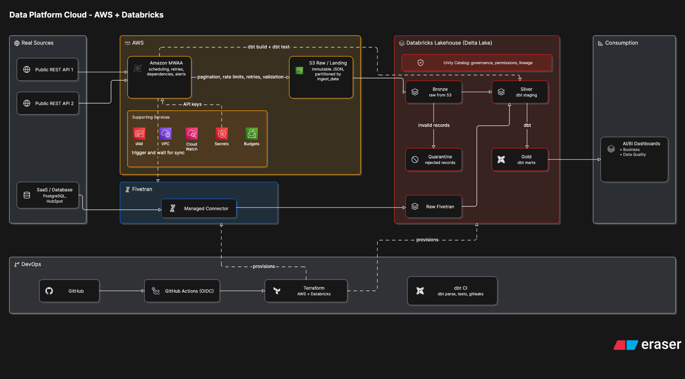

# Cloud Data Platform

End-to-end, 100% cloud data platform built on **real data**: ingestion from public APIs and a SaaS/DB source, a medallion architecture on Databricks, dbt transformations, Unity Catalog governance and infrastructure as code.

> The sources are real; the pipeline that ingests, transforms and governs them is real too.

## Architecture



Full details: [Technical Datasheet (PDF)](docs/technical_datasheet.pdf)

## Stack

| Layer | Technology |
|---|---|
| Cloud / Storage | AWS, S3 |
| Orchestration | Amazon MWAA (Apache Airflow) |
| Ingestion | Python (APIs), Fivetran (SaaS/DB) |
| Lakehouse | Databricks, Delta Lake |
| Governance | Unity Catalog |
| Transformation | dbt-core, dbt-databricks |
| BI | Databricks AI/BI |
| IaC | Terraform |
| CI/CD | GitHub Actions (OIDC) |
| Secrets | AWS Secrets Manager |

## Data Sources

| Source | Type | Path |
|---|---|---|
| `<API 1>` | Public REST API | Airflow > S3 > Bronze |
| `<API 2>` | Public REST API | Airflow > S3 > Bronze |
| `<SaaS/DB>` | Fivetran connector | Fivetran > Databricks |

## Data Layers

- **Bronze:** data close to the source, with technical metadata (`_batch_id`, `_ingested_at`, `_source_file`, `_source_system`, `_batch_date`).
- **Silver:** types, deduplication, normalization and business rules (dbt staging).
- **Gold:** analytical dimensions and facts (dbt marts).
- **Quarantine:** records rejected by validations.

## Repository Structure

```
├── ingestion/        # extraction code (APIs) and Fivetran config
├── orchestration/    # Airflow DAGs
├── dbt_project/      # models, snapshots, tests, macros
├── infra/terraform/  # AWS and Databricks
├── docs/             # datasheet and diagrams
├── tests/
└── .github/workflows/
```

## Getting Started

**Prerequisites:** AWS account, Databricks workspace (AWS), Terraform, Python 3.11+, dbt-core with dbt-databricks.

```bash
# 1. Infrastructure
cd infra/terraform/aws && terraform init && terraform plan
cd ../databricks && terraform init && terraform plan

# 2. Python dependencies
pip install -r requirements.txt

# 3. dbt
cd dbt_project
dbt deps
dbt build
```

Credentials and API keys live in AWS Secrets Manager, never in the repository.

## CI/CD

| Event | Actions |
|---|---|
| Pull Request | tests, `dbt parse`, lint, gitleaks, `terraform plan` |
| Merge to `main` | `terraform apply`, Databricks deployment, `dbt build` |

## Roadmap

- [ ] S3, IAM and Unity Catalog (storage credential + external location)
- [ ] API 1 ingestion > S3 > Bronze
- [ ] dbt models (staging, marts, tests)
- [ ] MWAA and the `daily_pipeline` DAG
- [ ] API 2 ingestion
- [ ] Fivetran (SaaS/DB source)
- [ ] Full Terraform and GitHub Actions
- [ ] AI/BI dashboards (business and data quality)

## Costs

MWAA and the SQL Warehouse are the most expensive components. An AWS Budget is configured; shut resources down when not in use.

## License

MIT
