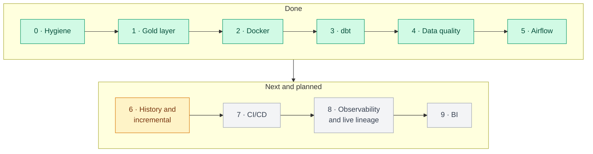
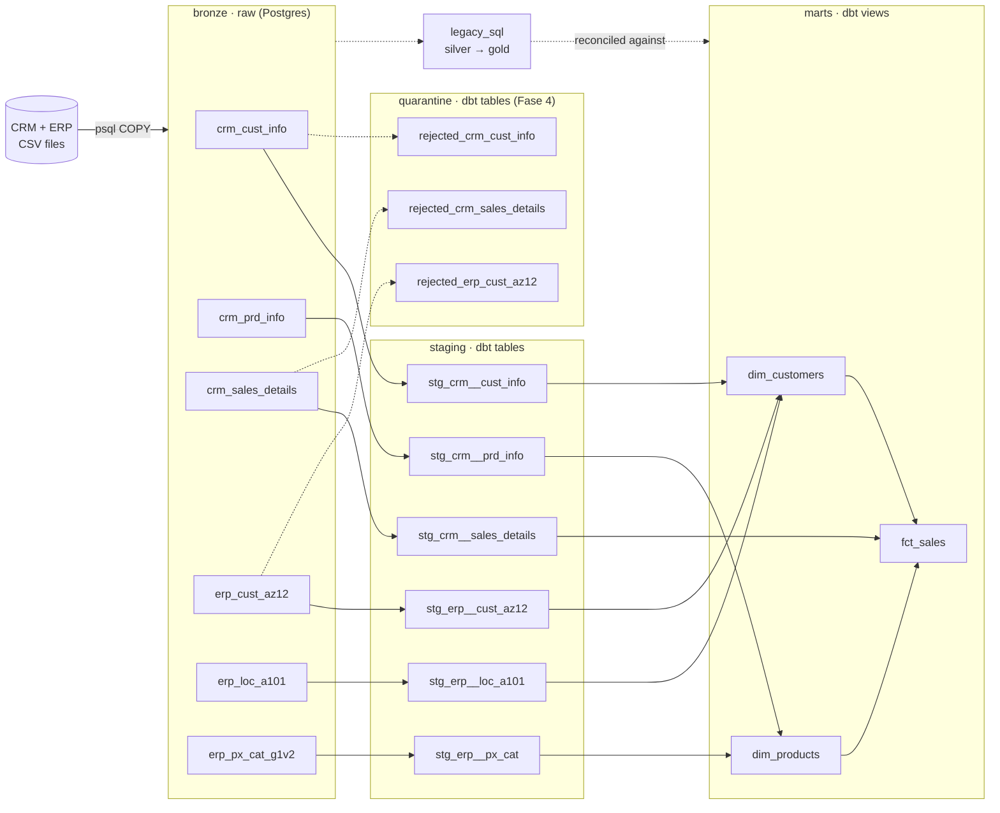

# 🧭 Project Hub

One page to see the whole project: where it stands, how data flows, which tool shows what, and how to start it. GitHub renders the diagrams below natively.

**Status:** Fase 5 closed (chore/airflow-hardening merged) · Fase 6 is next · updated September 2026

Quick links: [Roadmap](../PLANO_MODERNIZACAO.md) · [Agent rules](../AGENTS.md) · [Data catalog](data_catalog.md) · [README](../README.md) · [Pull requests](https://github.com/Afonsosequeira04/Data-Warehouse-Project/pulls) · [Notion](https://app.notion.com/p/Data-Warehouse-Project-3c745b08c0b680ffa7fed0b348f511d0?source=copy_link)

---

## 1. Where we are



| Phase | Goal | Status |
|---|---|---|
| 0 · Hygiene and foundation | Clean repo base | ✅ Done |
| 1 · Gold layer | Complete the Gold layer in plain SQL | ✅ Done |
| 2 · Containerization | Postgres + pipeline in Docker Compose | ✅ Done |
| 3 · dbt migration | Silver/Gold logic as dbt models, tests, docs | ✅ Done |
| 4 · Advanced data quality | An invalid source row never goes unnoticed (test results and/or quarantine) | ✅ Done |
| 5 · Orchestration (Airflow) | The pipeline runs itself from the Airflow UI, with retries and alerts | ✅ Done |
| 6 · History and incremental loads | Stop losing history on full reloads (e.g. gender change creates a new dimension row) | 🔜 Next |
| 7 · CI/CD | No PR with a failing dbt test can be merged unnoticed | ⏳ Planned |
| 8 · Observability and live lineage | Answer "did the pipeline run well yesterday?" from a dashboard, and watch lineage live in Marquez | ⏳ Planned |
| 9 · Consumption / BI | Dashboards on the marts | ⏳ Planned |

---

## 2. Data lineage (today)



Solid arrows are the live dbt pipeline. Dotted arrows are the original plain-SQL Silver/Gold, kept only to reconcile the dbt output (see [validation](validacao_fase3.md)).

### Warehouse at a glance (Fase 4 baseline, see [quarantine report](quarentena_fase4.md))

| Source table | Bronze rows | Staging rows |
|---|---:|---:|
| crm_cust_info | 18,494 | 18,484 |
| crm_prd_info | 397 | 397 |
| crm_sales_details | 60,398 | 60,398 |
| erp_cust_az12 | 18,484 | 18,484 |
| erp_loc_a101 | 18,484 | 18,484 |
| erp_px_cat_g1v2 | 37 | 37 |

| Quarantine table | Rows | Captures |
|---|---:|---|
| rejected_crm_cust_info | 4 | cst_id IS NULL (dropped by staging dedupe) |
| rejected_crm_sales_details | 35 | sls_sales or sls_price invalid (silently recalculated in staging) |
| rejected_erp_cust_az12 | 16 | bdate > CURRENT_DATE (silently nulled in staging) |

| Mart | Rows |
|---|---:|
| dim_customers | 18,484 |
| dim_products | 295 |
| fct_sales | 60,398 |

---

## 3. Which tool shows what

| I want to see… | Tool | How to open | Available |
|---|---|---|---|
| Models, columns, tests and static lineage | **dbt docs** | `make dbt-docs` (stop with Ctrl+C) | ✅ Now |
| Tables, data and an ER diagram | **DBeaver** or any SQL client | host `localhost`, port = `POSTGRES_PORT` in `infra/.env`, db `data_warehouse_project`, schemas `staging` and `marts` | ✅ Now |
| What work is left and what is in review | **Notion** (planning) + **GitHub pull requests** + [roadmap](../PLANO_MODERNIZACAO.md) | links at the top | ✅ Now |
| Pipeline runs, task graph, schedules, logs | **Airflow UI** | `http://localhost:8080` | ✅ Now |
| Live lineage: tables updating as a run happens | **Marquez** (OpenLineage) | `http://localhost:3000` | Fase 8 |
| Pipeline health: test pass rate, run duration | **Metabase** health dashboard | see port map below | Fase 8 |
| Business dashboards on the marts | **Metabase** (or Power BI) | see port map below | Fase 9 |

dbt docs shows the *structure* of the project; Marquez shows what *actually ran*. They complement each other.

---

## 4. Port map (avoid collisions before they happen)

| Service | Default port | Suggested host port | Note |
|---|---|---|---|
| Warehouse Postgres | 5432 | `POSTGRES_PORT` in `infra/.env` | Use `5433` if a local Postgres (e.g. Postgres.app) is running |
| dbt docs | 8080 | 8081 | Airflow also wants 8080 |
| Airflow UI | 8080 | 8080 | |
| Airflow Metadata DB | 5432 | (internal only) | No host port; separate from warehouse |
| Marquez UI | 3000 | 3000 | |
| Marquez API | 5000 | 5000 | On macOS, port 5000 is commonly held by AirPlay Receiver; disable it or remap |
| Marquez internal Postgres | 5432 | 5434 | Must differ from the warehouse port |
| Metabase | 3000 | 3001 | Marquez UI also wants 3000 |

Running everything at once is heavy on a laptop. When Airflow, Marquez and Metabase arrive, use Docker Compose profiles (for example `--profile lineage`) to start only what you need.

---

## 5. Quick start

```bash
make dbt-setup     # once: create .venv and install dbt
make all-dbt       # from zero to marts: up -> init-db -> validate-headers -> load-bronze -> dbt-build
make dbt-build     # rebuild staging + marts and run all tests
make dbt-docs      # open the dbt docs (lineage + catalog)
make all           # legacy pipeline (bronze -> silver -> gold), for comparison

make airflow-build # once: build Airflow image
make airflow-up    # start Airflow stack (Postgres + Metadata DB + Webserver + Scheduler)
# Open http://localhost:8080 (user: admin, pass: admin)
# Enable and trigger the 'dwh_pipeline' DAG
```

`make init-db` (and therefore `make all` / `make all-dbt`) drops the whole database. Full command list: [AGENTS.md](../AGENTS.md#-commands).

---

## 6. Repo map

| Path | What it holds |
|---|---|
| `datasets/` | Source CSVs (CRM and ERP) |
| `infra/` | `docker-compose.yml`, `airflow.Dockerfile`, `.env.example` |
| `scripts/` | Database init and Bronze ingestion (stays outside dbt) |
| `dbt_project/` | dbt models (`staging`, `marts`, `quarantine`), macros, profiles, tests |
| `airflow/` | DAGs (`dwh_pipeline.py`) and notifications (`notifications.py`) |
| `legacy_sql/` | Original Silver and Gold SQL, kept for reconciliation |
| `docs/` | This hub, the [data catalog](data_catalog.md), baseline, validation and quarantine reports |
| `.dockerignore` | Excludes `dbt_packages/`, `target/`, `logs/`, `.venv/`, `.env*`, `.git/`, etc. from Docker build context |

---

## 7. Keeping this hub current

At the end of every phase (the "Phase closing" step in [AGENTS.md](../AGENTS.md)):

1. In section 1, mark the closed phase ✅ and the next one 🔜, and move the `:::done` / `:::next` classes in the roadmap diagram.
2. Update the **Status** line at the top.
3. Refresh the row counts in section 2 if they changed.
4. Update sections 3 and 4 when a new tool becomes available.