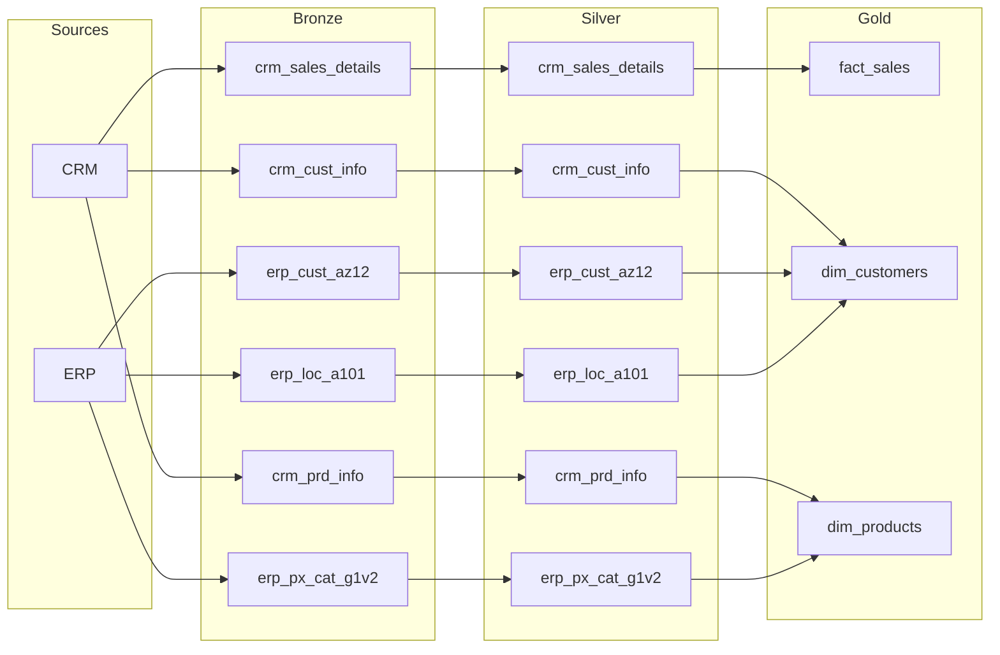

# Data Catalog — Gold Layer / Marts

This document describes the columns and data lineage of every object
in the `gold` schema (legacy) and `marts` schema (dbt). It is the single
source of truth for analysts, BI developers, and data scientists
consuming the warehouse.

> **Nota (Fase 3):** A partir da Fase 3, a camada Gold (legacy views em `gold.*`)
> e a camada Silver (legacy tables em `silver.*`) são mantidas em `legacy_sql/`
> apenas para referência histórica e reconciliação. A fonte de verdade para
> transformações passa a ser o **dbt** — modelos em `dbt_project/models/`
> (staging em `staging.*`, marts em `marts.*`). A documentação oficial de
> colunas, testes e lineage é gerada automaticamente via `dbt docs generate`
> (veja `make dbt-docs`). Este arquivo `data_catalog.md` permanece como
> referência histórica do design da Fase 1.

---

## Lineage Diagram

The diagram below shows the Bronze → Silver → Gold data flow.
(Keep this Mermaid block in sync with `scripts/gold/ddl_gold.sql`.
The PNG diagrams in `docs/` are not updated in Fase 1 — they will be
revisited in Fase 3 when the architecture changes.)

---

## gold.dim_customers

A customer dimension merging CRM (person + demographic data) and
ERP (birthdate + country) sources. Key resolution happens at the
Silver layer (`cst_key` ≡ `cid`).

| Column                 | Type      | Source (Silver)              | Notes                                                                 |
|------------------------|-----------|------------------------------|-----------------------------------------------------------------------|
| customer_key           | integer   | *(generated)*                | Surrogate key, sequential integer from `ROW_NUMBER()`.                |
| customer_id            | varchar   | crm.cst_key / erp.cid        | Business customer key (common value).                                 |
| crm_customer_id        | integer   | silver.crm_cust_info.cst_id  | CRM internal ID.                                                      |
| erp_customer_id        | varchar   | silver.erp_cust_az12.cid     | ERP internal ID (NAS prefix stripped).                                  |
| customer_full_name     | varchar   | crm.cst_firstname/lastname   | Concatenated `firstname + ' ' + lastname`.                            |
| customer_first_name    | varchar   | silver.crm_cust_info         | Trimmed.                                                              |
| customer_last_name     | varchar   | silver.crm_cust_info         | Trimmed.                                                              |
| marital_status         | varchar   | silver.crm_cust_info         | Standardized to `Single`/`Married`/`n/a`.                             |
| gender                 | varchar   | crm.cst_gndr / erp.gen       | CRM takes priority; ERP gender fills in where CRM is null or `'n/a'`. Values: `Male`/`Female`/`n/a`.     |
| birth_date             | date      | silver.erp_cust_az12.bdate   | Future dates nulled by Silver.                                        |
| country                | varchar   | silver.erp_loc_a101.cntry    | Standardized (e.g. `Germany`, `United States`).                       |
| customer_create_date   | date      | silver.crm_cust_info         | When the customer record was created in CRM.                          |
| crm_source_system      | varchar   | silver.crm_cust_info         | Usually `'CRM'`.                                                      |
| erp_source_system      | varchar   | silver.erp_cust_az12         | Usually `'ERP'`.                                                      |
| dwh_create_date        | timestamp | silver.crm_cust_info         | Row creation timestamp in the warehouse.                              |

### Merge logic

- **Join key:** `silver.crm_cust_info.cst_key` ↔ `silver.erp_cust_az12.cid`.
  Silver normalizes both keys (strips `NAS` prefix, removes dashes),
  so they align 1:1.
- **FULL OUTER JOIN** so customers in either system (but not both) are kept.
- **Gender priority:** `COALESCE(c.cst_gndr, e.gen, 'n/a')` — CRM gender
  wins; ERP gender fills gaps.
- **Country** comes from `erp_loc_a101.cntry`, joined on `cid`.

---

## gold.dim_products

A product dimension merging CRM product data (pricing, cost, lifecycle)
with ERP category data (category/subcategory/maintenance flag).

| Column                | Type      | Source (Silver)              | Notes                                                                 |
|-----------------------|-----------|------------------------------|-----------------------------------------------------------------------|
| product_key           | integer   | *(generated)*                | Surrogate key, sequential integer.                                    |
| product_key_business  | varchar   | silver.crm_prd_info.prd_key  | Human-readable product identifier (e.g. `BK-M82B-44`).                |
| crm_product_id        | integer   | silver.crm_prd_info.prd_id   | CRM/ERP internal product ID.                                          |
| category_id           | varchar   | silver.crm_prd_info.cat_id   | Extracted from `prd_key` prefix. Matches `erp_px_cat_g1v2.id`.          |
| product_name          | varchar   | silver.crm_prd_info.prd_nm   | Product name.                                                         |
| product_cost          | integer   | silver.crm_prd_info.prd_cost | Cost; nulls defaulted to 0 by Silver.                                 |
| product_line          | varchar   | silver.crm_prd_info.prd_line | Standardized: `Mountain`/`Road`/`Other Sales`/`Touring`/`n/a`.        |
| product_start_date    | date      | silver.crm_prd_info.prd_start_dt | Product introduction date.                                        |
| product_end_date      | date      | silver.crm_prd_info.prd_end_dt   | Product end-of-life date (null = current product).               |
| category              | varchar   | silver.erp_px_cat_g1v2.cat   | Product category (e.g. `Components`).                                 |
| subcategory           | varchar   | silver.erp_px_cat_g1v2.subcat| Product subcategory (e.g. `Mountain Frames`).                         |
| maintenance_required  | varchar   | silver.erp_px_cat_g1v2.maintenance | `Yes`/`No` from ERP.                                      |

### Merge logic

- **Join key:** `silver.crm_prd_info.cat_id` ↔ `silver.erp_px_cat_g1v2.id`.
- **LEFT JOIN** from CRM → ERP (ERP category info is supplementary).
- Products without a matching ERP category still appear with `n/a`.

---

## gold.fact_sales

The central fact table for all sales transactions. Connects
`crm_sales_details` to `dim_customers` and `dim_products` via
surrogate keys.

| Column             | Type      | Source (Silver)                    | Notes                                                                 |
|--------------------|-----------|------------------------------------|-----------------------------------------------------------------------|
| sales_key          | integer   | *(generated)*                      | Surrogate key.                                                        |
| sales_order_number | varchar   | silver.crm_sales_details.sls_ord_num | Order number (e.g. `SO43697`).                                    |
| customer_key       | integer   | gold.dim_customers.customer_key    | FK to dim_customers (via `sls_cust_id` → `crm_customer_id`).          |
| product_key        | integer   | gold.dim_products.product_key      | FK to dim_products (via `sls_prd_key` → `product_key_business`).      |
| erp_customer_ref   | integer   | silver.crm_sales_details.sls_cust_id | Raw customer reference before join.                                 |
| product_business_key | varchar | silver.crm_sales_details.sls_prd_key | Raw product key before join.                                       |
| order_date         | date      | silver.crm_sales_details.sls_order_dt | Converted from INT (YYYYMMDD) by Silver.                           |
| ship_date          | date      | silver.crm_sales_details.sls_ship_dt | Converted from INT by Silver.                                      |
| due_date           | date      | silver.crm_sales_details.sls_due_dt | Converted from INT by Silver.                                        |
| sales_amount       | integer   | silver.crm_sales_details.sls_sales | Total sales; recalculated if inconsistent (qty × price).              |
| sales_quantity     | integer   | silver.crm_sales_details.sls_quantity | Quantity ordered.                                                  |
| unit_price         | integer   | silver.crm_sales_details.sls_price | Price per unit; recalculated if inconsistent.                       |
| dwh_create_date    | timestamp | silver.crm_sales_details.dwh_create_date | Row load timestamp.                                           |

### Partitioning strategy (documented, deferred to Fase 3+)

- **Key:** `order_date` (`sls_order_dt`), RANGE partitioned by month.
- **Rationale:** Time-series queries dominate; this column is already
  a clean `DATE` from Silver.
- **When implemented:** Convert `fact_sales` from a VIEW to a
  PARTITIONED TABLE. Each monthly partition inherits indexes on
  `customer_key` and `product_key` (local indexes) for join performance.
- **Not yet implemented** in Fase 1 — `fact_sales` is a view that reads
  through to Silver on every query.

---

## Cross-layer notes

| Topic            | Bronze                        | Silver                                   | Gold                          |
|------------------|-------------------------------|------------------------------------------|-------------------------------|
| Object type      | Table                         | Table                                    | View                          |
| Load strategy    | Full reload (TRUNCATE+INSERT) | Full reload (TRUNCATE+INSERT)            | Computed on query             |
| Identity column  | `cst_id` (INT)                | `cst_id` (INT)                           | `customer_key` (surrogate)    |
| Date format      | `sls_order_dt` as INT (YYYYMMDD) | `sls_order_dt` as DATE               | `order_date` as DATE          |
| Error handling   | Retry + log to `bronze.load_errors` | WARNING-level exceptions              | N/A (views)                   |
